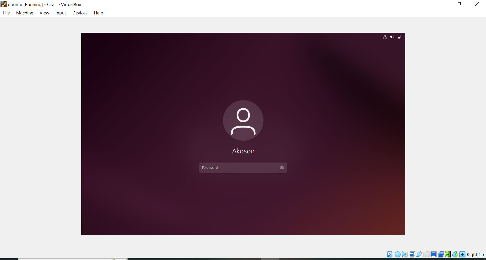

# MINI PROJECT ON TECH ENVIRONMENT SETUP

## PROJECT DESCRIPTION

## This mini project provide a detailed screenshot of essential software tools used in setting up Tech Environment for the DevOps course. The software tools includes:

+ Oracle Virtual Box**
+ Ubuntu LTS
+ Virtual Studio Code
+ Github Account
+ AWS Acoount

## SOFTWARE TOOLS DESCRIPTION AND ENVIRONMENT SCREENSHOTS 

## ORACLE VIRTUAL Box

### Oracle Virtualbox is a free and open-source virtualization software that allows users to run multiple operating system on a single physical machine. It enables the creation and management of virtual machines, making it useful for testing software, running different operating system environment, and servervirtualization.

## KEY FEATURES:

+ Supports Windows, Linux, MacOS, and other operating systems.
+ Snapshots for saving virtual machine states.
+ Seamless mode for integrating virtual machine and host operating system.
+ USB, networking, and shared folder support.

### VIRTUALBOX ENVIRONMENT SCREENSHOT

## UBUNTU LTS

### Ubunti is a stable and secure version of the Ubuntu Linux operating system, release every two years with five years of support for security and bug fixes. It is widely used for servers, desktops, and cloud computing due to its reliability and extended support period.

## KEY FEATURES:

+ Long term support for five years
+ User-Friendly easy to install and use
+ Secure and stable due to regular security patches
+ Open-Source free to use and customize
+ Widely use by developers, businneses and personal used.

## UBUNTU ENVIRONMENT SCREENSHOT

## VISUAL STUDIO CODE

### Visual studio code is a free lightweight, and powerful code editor developed by Microsoft. It supports multiple programming languages, extensions, and debugging tools. making it a popular choice for developers.

## KEY FEATURES:

+ Built in Git integration
+ Extension for additional functionality
+ Debugger and intelliSense
+ Cross-platform (Windows, MacOs, Linux)

## VISUAL STUDIO ENVIROMENT SCREENSHOT

## GITHUB

### Github is a cloud base version control platform for managing and sharing code using GIT. It allows collaboration, tracking changes, and hosting open-source and private repositories. 

>## KEY FEATURES: 

+ Git version control and collaboration
+ Pull request and issue tracking
+ CI/CD support(Github Action)
+ Public and private repositories for projects.

## GITHUB ENVRONMENT SCREENSHOT

## AAMAZON WEB SERVICE (AWS ACCOUNT)

### Amazon Web Service is a cloud cloud computing platform that offers scalable computing power, storage, databases, and AI services. It is widely used for web hosting, machine learning and enterprise applications.

## KEY FEATURES:

+ Compute services (EC2, Lamda)
+ Storage solution (S3, EBS)
+ Databases (RDS, DynamoDB)
+ Security and scalability for businesses.

## AMAZON WEB SERVICE ACCOUNT SCREENSHOT

